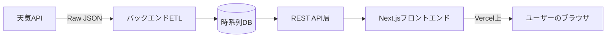

## 1. プロジェクト概要  
**タイトル:** 東京過去気温ダッシュボード  
**目的:**  
- 過去数年分の東京の日別気温傾向をインタラクティブに可視化する。  
- 気候変動の兆候や季節ごとの変化をわかりやすく示す。  

## 2. 範囲  
### MVPで対応する機能  
- **データ取得:** 過去3～5年分の東京の歴史的日別気温データを取得  
- **データ処理:** 7日間移動平均による平滑化  
- **可視化:** 年ごとに別系列として折れ線グラフ表示  
- **UI/UX:** 比較したい年を選択できるシンプルなレスポンシブ画面  

### MVPの対象外  
- ユーザー認証・個人設定  
- リアルタイム予測やライブ更新（夜間バッチ更新のみ）  
- データのエクスポート（PDF／CSV）  

## 3. 機能要件  
1. **データ取得（Ingestion）**  
   - Open-Meteo Historical Weather APIから以下を取得  
     - 日ごとの最高気温・最低気温・平均気温
     - API例
      - curl "https://archive-api.open-meteo.com/v1/archive" \
      --get \
      --data-urlencode "latitude=35.6895" \
      --data-urlencode "longitude=139.6917" \
      --data-urlencode "start_date=2022-01-01" \
      --data-urlencode "end_date=2022-12-31" \
      --data-urlencode "daily=temperature_2m_mean,temperature_2m_min,temperature_2m_max" \
      --data-urlencode "timezone=Asia/Tokyo"

   - APIレート制限への対応（リトライ／バックオフ）  
   - 原データを時系列DB（PostgreSQL+TimescaleDB など）に保存  
2. **ETLパイプライン**  
   - 画面上の「データ取得」ボタンによる手動トリガー実行
     1. 最終登録日以降のデータを取得
     2. 初回取得時は過去10年分をチャンク分割（例：1年単位）で順次取得
     3. 各チャンクで欠損値・異常値チェック
     4. 7日間中央移動平均の計算
     5. Prisma の upsert で DB に保存
     6. 処理後に JSON レスポンスで完了件数を返却
   - エラーハンドリング：リトライ／バックオフ／アラート通知
3. **API層**  
   - REST エンドポイント例：  
     - `/api/temperatures?year=2022` →  
       ```json
       [{ "date": "2022-01-01", "avg7": 6.5 }, …]
       ```  
     - 複数年対応：`/api/temperatures?years=2021,2022,2023`  
   - キャッシュ／レート制限対応  
4. **データ可視化**  
   - 各年を別系列で表示する折れ線グラフ  
   - 凡例で年ごとの表示・非表示切り替え  
   - ホバー時に【日付・原データ平均気温・7日移動平均】をツールチップ表示  
   - タイム軸のパン／ズーム機能  
5. **設定・UI操作**  
   - 年選択用チェックボックスリスト  
   - 日付範囲スライダー（上級MVPオプション）  
   - ダーク／ライトモード切替  

## 4. 非機能要件  
- **パフォーマンス:**  
  - APIレスポンス 500ms 以下（単年度）  
  - モバイル3G環境でページロード 2秒以下  
- **スケーラビリティ:**  
  - 月間10万ユーザー想定  
- **信頼性:**  
  - 稼働率 99.9%以上  
  - 障害時アラート  
- **セキュリティ:**  
  - 全通信 HTTPS  
  - 入力パラメータのサニタイズ  
- **アクセシビリティ:**  
  - WCAG 2.1 AA 準拠  
- **ローカリゼーション:**  
  - 当面は英語UI（将来日本語対応検討）  

## 5. 技術アーキテクチャ  


- フロントエンド：Next.js + React + TypeScript + Tailwind CSS  
- バックエンド：Node.js（Express／Fastify）  
- DB：PostgreSQL + TimescaleDB 拡張または InfluxDB  
- ホスティング：Vercel フロントエンド＋サーバレス関数  

## 6. データ要件  
| 項目名         | 型      | 説明                          |
|---------------|--------|-----------------------------|
| `date`        | date   | 日付 (YYYY-MM-DD)            |
| `temp_high`   | float  | 日ごとの最高気温 (℃)        |
| `temp_low`    | float  | 日ごとの最低気温 (℃)        |
| `temp_avg`    | float  | 日ごとの平均気温 (℃)        |
| `temp_avg7`   | float  | 7日間移動平均の平均気温 (℃) |
| `source`      | string | データ取得元API名            |

## 7. ユーザーストーリーと受け入れ基準  
1. **気候変動に関心のある利用者として**  
   - 年ごとの気温推移を比較できるようにしたい  
   - **AC:** グラフに複数年系列が表示され、凡例で切り替えられる  
2. **研究者として**  
   - 平滑化前後の値をツールチップで確認したい  
   - **AC:** ホバー時に原データと移動平均の両方を表示  
3. **モバイルユーザーとして**  
   - 通信状況が悪くても素早くアクセスしたい  
   - **AC:** 3G環境で2秒以内にロード完了  

## 8. 実装計画とタイムライン  
| フェーズ                 | タスク                                                                 | 期間      |
|--------------------------|----------------------------------------------------------------------|-----------|
| **1. キックオフ＆設計**       | 要件確定、ワイヤーフレーム作成、データソース検証スパイク                   | 1週間     |
| **2. データパイプライン構築** | ETLジョブ開発、DBスキーマ設計、データ品質チェック実装                      | 2週間     |
| **3. API開発**             | RESTエンドポイント実装、キャッシュ・レート制御                          | 1週間     |
| **4. フロントエンドMVP**      | Next.jsアプリ骨組み、チャートライブラリ統合、UIコントロール実装              | 2週間     |
| **5. テスト＆QA**           | 単体テスト、E2Eテスト、パフォーマンステスト                             | 1週間     |
| **6. デプロイ＆運用準備**      | Vercelでのデプロイ設定、ログ・アラート設定、運用手順書作成                  | 1週間     |
| **合計**                   |                                                                      | **8週間** |

## 9. リスクと緩和策  
- **歴史データ取得の制限**  
  - *緩和策:* 気象庁APIやNOAAなど代替ソースを検討、必要に応じて有料プラン契約  
- **データ欠損・異常**  
  - *緩和策:* 閾値チェックと補間アルゴリズムによる自動補完  
- **大規模アクセス時のパフォーマンス低下**  
  - *緩和策:* Redisキャッシュ導入、データページネーション、CDN活用  

## 10. 今後の拡張案  
- 他都市・多地点対応（ドロップダウンや地図選択）  
- 湿度、降水量、風速などの気象指標追加  
- 任意期間比較＆CSVダウンロード機能  
- ユーザーアカウント機能（例：7日平均が30℃超えたら通知）  

